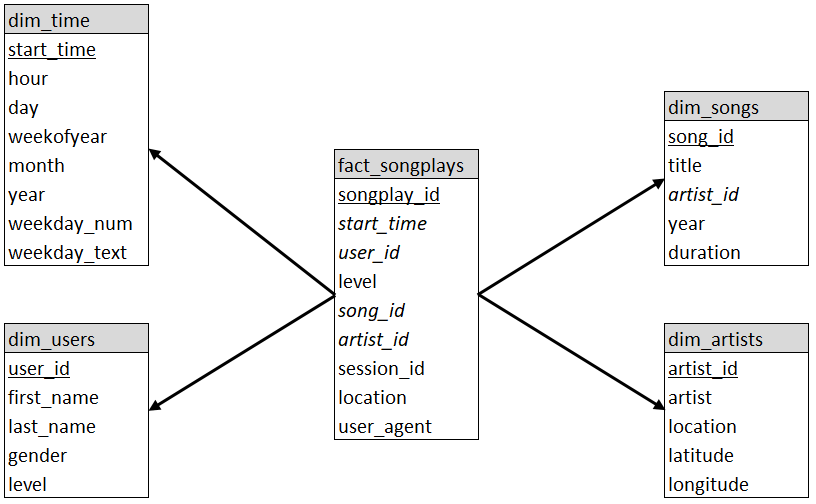

<h1>Sparkify Music Song Play Analytics</h1>
<h2>Introduction</h2>

The scope of this database set up is to load songs and user activity from Sparkify's new music streaming app, and be able to analyse what users are listeining to.

 
<h2>Data Warehouse setup</h2>
<h3>Fact Table</h3>

The scope of the fact table is to provide metrics and facts on songs being played by users on the Sparkify streaming app. The fact table contains the following columns:

<h4>fact_songplays</h4>
<ul>
    <li>songplay_id</li>
    <li>start_time</li>
    <li>user_id</li>
    <li>level</li>
    <li>song_id</li>
    <li>artist_id</li>
    <li>session_id</li>
    <li>location</li>
    <li>user_agent</li>
</ul>

<i>songplay_id</i> is the primary key uniquely identifying the fact table row. 
<i>start_time</i> is a foreign key referencing the primary key in the dim_time dimension table. 
<i>user_id</i> is a foreign key referencing the primary key in the dim_users dimension table. 
<i>song_id</i> is a foreign key referencing the primary key in the dim_songs dimension table. 
<i>artist_id</i> is a foreign key referencing the primary key in the dim_artists dimension table.    

<h3>Dimension Tables</h3>

The scope of the dimension tables is to provide descriptive attributes to the fact table, when querying the fact table. The dimension tables and their columns are shown below:

<h4>dim_time</h4>
<ul>
    <li>start_time</li>
    <li>hour</li>
    <li>day</li>
    <li>weekofyear</li>
    <li>month</li>
    <li>year</li>
    <li>weekday_num</li>
    <li>weekday_text</li>
</ul>    

<i>start_time</i> is the primary key uniquely identifying the dimension table row. 
This dimension table provides time related attributes when querying the fact table. For example, when joining the fact table with the dim_time dimension table in a SQL query, all fact table rows for a specific month can be queried. 

<h4>dim_users</h4>
<ul>
    <li>user_id</li>
    <li>first_name</li>
    <li>last_name</li>
    <li>gender</li>
    <li>level</li>
</ul>    

<i>user_id</i> is the primary key uniquely identifying the dimension table row.     
This dimension table provides user related attributes when querying the fact table. For example, when joining the fact table with the dim_users dimension table in a SQL query, all fact table rows for a specific user's name can be queried.     

    
<h4>dim_songs</h4>
<ul>
    <li>song_id</li>
    <li>title</li>
    <li>artist_id</li>
    <li>year</li>
    <li>duration</li>
</ul>    

<i>song_id</i> is the primary key uniquely identifying the dimension table row. 
<i>artist_id</i> is a foreign key referencing the primary key in the dim_artists dimension table.     
This dimension table provides song related attributes when querying the fact table. For example, when joining the fact table with the dim_songs dimension table in a SQL query, all fact table rows related to a specific song title can be queried.     

    
<h4>dim_artists</h4>
<ul>
    <li>artist_id</li>
    <li>artist</li>
    <li>location</li>
    <li>latitude</li>
    <li>longitude</li>        
</ul>    

<i>artist_id</i> is the primary key uniquely identifying the dimension table row.     
This dimension table provides artist related attributes when querying the fact table. For example, when joining the fact table with the dim_artists dimension table in a SQL query, all fact table rows related to a specific artist can be queried.     

<h3>Schema</h3>

The fact table references the dimension tables using a star schema, as shown in the figure below.

 
<h2>ETL pipeline</h2>
<h3>First time Database setup</h3>

To create the database and and set up the data warehouse fact and dimension tables, a one-time python script needs to be executed. The command to be executed, if executed from within Jupyter Notebook, is the one shown below:

  
%run -i './create_tables.py'    

<h3>Loading data</h3>

When the database and tables have been created, a python script needs to be executed to populate the fact and dimension tables. Tables are populated with data from song and log files. The command to be executed, if executed from within Jupyter Notebook, is the one shown below:

%run -i './etl.py'

This ETL script has some built-in error handling. If one of the files being loaded contains invalid data, instead of causing the ETL to fail and stop, data from that file is not loaded and the ETL can continue with the rest of the files. An example of this can be seen from the figure below. The file <i>TRAAAAW128F429D538e.json</i> contains a non-numeric character in the duration field and would thus cause the ETL to fail if not handled.

    

 
<h2>Analytic queries</h2>

When data has been loaded to the data warehouse, a number of reports are available giving insight into the data. To access these reports the command to be executed, if executed from within Jupyter Notebook, is the one shown below:

%run -i './etl_reports.py'

A menu will be displayed, and the desired report number can be entered.

   

<h3>Report description</h3>
<h4>Top 5 users' songplays count by level</h4>

This report lists the top 5 users using the free service, and the top 5 users using the paid service.

   

<h4>Songplays count by day of month, hour, level</h4>

This report asks for the desired year, month and day to display, then lists the free and paid song plays count by hour for the day which has been entered. The lowest values are highlighted in red, whilst the highest values are highlighted in green.

 

<h4>Songplays count by day of month, level</h4>

This report lists the free and paid song plays count by day of month. The lowest values are highlighted in red, whilst the highest values are highlighted in green.

 

<h4>Songplays count by hour, level</h4>

This report lists the free and paid song plays count by hour. The lowest values are highlighted in red, whilst the highest values are highlighted in green.

 

<h4>Songplays count by weekday, level</h4>

This report lists the free and paid song plays count by day of the week. The lowest values are highlighted in red, whilst the highest values are highlighted in green.

 

<h4>Songplays count of users with free and paid songplays</h4></b>

This report lists the users using both the free service and the paid service. The lowest values are highlighted in red, whilst the highest values are highlighted in green.

 